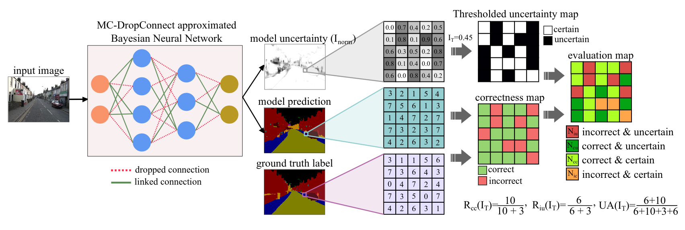

# mc_dropconnect
The official implementation of the MC-Dropconnect method for Uncertainty Estimation in DNNs proposed in 
the paper [DropConnect Is Effective in Modeling Uncertainty of Bayesian Deep Networks](https://arxiv.org/abs/1906.04569).


*Overview of the proposed approximate Bayesian model (Left) and metrics to evaluate the uncertaintyquality 
(Right) in a semantic segmentation example.*

## Dependencies
- Python 3.6
- NumPy 1.15.3
- [Tensorflow](https://github.com/tensorflow/tensorflow)>=1.11
- Matplotlib 3.0.1 (for saving images)
- h5py 1.10.2
- tqdm 4.28.1

## How to run the code

### 1. Prepare your data
Download your desired data, put it in a separate directory and modify the path in the ```config.py``` file accordingly. 

### 2. Train
Most of the network hyper-parameters can be found in ```config.py``` file. You may modify them or run with
the default values which runs the DECAPS proposed in the paper.


Training the model displays the training results and saves the trained model if an improvement observed in the accuracy value.
- For training with the default setting: ```python main.py ```
- For training with a different batch size: ```python main.py --batch_size=16```

### 3. Test:
- For running the test: ```python main.py --mode=test ```.

## Citation
```
@article{mobiny2019dropconnect,
  title={DropConnect Is Effective in Modeling Uncertainty of Bayesian Deep Networks},
  author={Mobiny, Aryan and Nguyen, Hien V and Moulik, Supratik and Garg, Naveen and Wu, Carol C},
  journal={arXiv preprint arXiv:1906.04569},
  year={2019}
}
```


